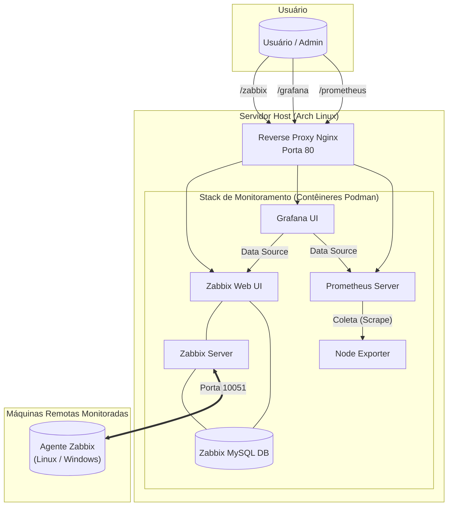

# Projeto Sentinela: Stack de Monitoramento com Podman

      

## 📖 Visão Geral do Projeto

O **Projeto Sentinela** nasceu de uma necessidade real: a dificuldade de gerenciar e prever falhas em uma infraestrutura de 15 servidores de clientes distribuídos em diferentes cidades. A impossibilidade de acesso físico rápido exigia uma solução que permitisse o monitoramento proativo e centralizado.

Esta solução é uma plataforma de monitoramento completa, segura e automatizada, construída do zero com as melhores ferramentas open-source. O ambiente é totalmente orquestrado com **Podman Compose** em modo **rootless**, garantindo maior segurança ao não expor o daemon do contêiner e ao rodar os serviços com privilégios mínimos.

O stack integra Zabbix, Prometheus e Grafana, oferecendo uma visão completa da saúde da infraestrutura e dos serviços, com scripts de implantação que automatizam a adição de novos hosts Linux e Windows.

## 🏛️ Arquitetura

A arquitetura foi desenhada para ser robusta e centralizada. Todas as requisições externas passam por um Proxy Reverso (Nginx) na porta 80, que as direciona para a interface web correspondente. Internamente, os serviços se comunicam em uma rede de contêineres segura.



## 🚀 Tecnologias Utilizadas

* **Containerização (`Podman` & `Podman Compose`):** Orquestração de contêineres em modo *rootless* (sem daemon e sem privilégios de root), proporcionando um ambiente mais seguro e isolado.
* **Monitoramento de Infraestrutura (`Zabbix`):** Coleta métricas de hardware, disponibilidade e serviços em sistemas operacionais diversos. Utiliza o recurso de **autorregistro** para adicionar novos hosts automaticamente.
* **Coleta de Métricas de Serviços (`Prometheus` & `Node Exporter`):** Focado em métricas de séries temporais, ideal para monitorar a saúde e o desempenho de aplicações e do próprio host do servidor.
* **Visualização e Dashboards (`Grafana`):** Interface unificada para criar, visualizar e explorar dashboards interativos com dados vindos tanto do Zabbix quanto do Prometheus.
* **Banco de Dados (`MySQL`):** Armazena todas as configurações e dados históricos coletados pelo Zabbix.
* **Proxy Reverso (`Nginx`):** Atua como ponto de entrada único para todos os serviços, simplificando o acesso com URLs amigáveis e permitindo a futura implementação de SSL/TLS.
* **Automação de Implantação (`Bash` & `PowerShell`):** Scripts para provisionar e configurar automaticamente o Zabbix Agent e o cliente VPN Tailscale em novas máquinas Linux e Windows.
* **Rede Segura (`Tailscale`):** Cria uma rede VPN privada (overlay network) para garantir a comunicação segura e estável entre o servidor Zabbix e os agentes, independentemente da sua localização física.

---

## ⚡ Guia de Uso e Instalação

### Parte 1: Configuração do Servidor Principal

Esta seção deve ser executada no servidor que irá hospedar o stack de monitoramento.

#### 1.1 Pré-requisitos
* Git, Podman e Podman Compose instalados.
* O servidor deve ter uma conta Tailscale configurada para obter um IP fixo na VPN.

#### 1.2 Clonar o Repositório
```bash
git clone [https://github.com/gabrielnasthy/stack-monitoramento-podman.git](https://github.com/gabrielnasthy/stack-monitoramento-podman.git)
cd stack-monitoramento-podman
```

#### 1.3 Configurar o Ambiente (`.env`)
O projeto é configurado através de um único arquivo `.env`.

1.  Copie o modelo de exemplo:
    ```bash
    cp .env.example .env
    ```
2.  Edite o arquivo `.env` com suas informações:
    ```bash
    nano .env
    ```
    Preencha as variáveis `ZABBIX_HOSTNAME`, `TZ`, e as senhas do MySQL.

#### 1.4 (Opcional) Configurar o Host para Produção
Para que os contêineres iniciem com o boot e o proxy funcione na porta 80, execute:
```bash
# Permitir que o usuário rootless use a porta 80
echo 'net.ipv4.ip_unprivileged_port_start=80' | sudo tee /etc/sysctl.d/99-podman-ports.conf
sudo sysctl --system

# Habilitar o início automático dos contêineres com o boot
# (Substitua 'seu_usuario' pelo seu nome de usuário)
sudo loginctl enable-linger seu_usuario
systemctl --user enable podman-restart.service
```

#### 1.5 Configurar o Autorregistro no Zabbix
Para que os hosts sejam adicionados automaticamente:
1.  Acesse a interface do Zabbix (após a primeira inicialização).
2.  Vá em **Administração** -> **Ações** -> **Ações de autorregistro**.
3.  Crie duas ações separadas, uma para Linux e outra para Windows, usando os **Metadados do host** `Linux-Auto` e `Windows-Auto` como condição, respectivamente.
4.  Em "Operações", configure cada ação para **Adicionar host**, **Adicionar ao grupo de hosts** apropriado e **Vincular ao template** correto (`Linux by Zabbix agent` ou `Windows by Zabbix agent`).

#### 1.6 Iniciar o Stack
```bash
podman-compose up -d
```
Aguarde de 3 a 5 minutos na primeira inicialização para que o Zabbix crie seu banco de dados.

### Parte 2: Usando os Scripts de Implantação de Agentes

Na pasta `scripts/`, você encontrará os scripts para provisionar novas máquinas.

1.  **Configure os Scripts:**
    * Navegue até a pasta `scripts/`.
    * Copie o modelo de configuração: `cp .env.example .env`.
    * Edite o arquivo `scripts/.env` e insira sua **Chave de Autenticação do Tailscale** e o **IP do seu servidor Zabbix**.

2.  **Execute no Cliente:**
    * **Para Linux:** Copie o script `deploy_zabbix_linux.sh` para a máquina cliente, dê permissão de execução (`chmod +x`) e rode com `sudo`.
    * **Para Windows:** Copie o script `deploy_zabbix_windows.ps1` para a máquina cliente e execute-o em um terminal PowerShell **como Administrador**.

Após a execução do script, o novo host se conectará à sua rede Tailscale e aparecerá automaticamente na interface do Zabbix, pronto para ser monitorado.
